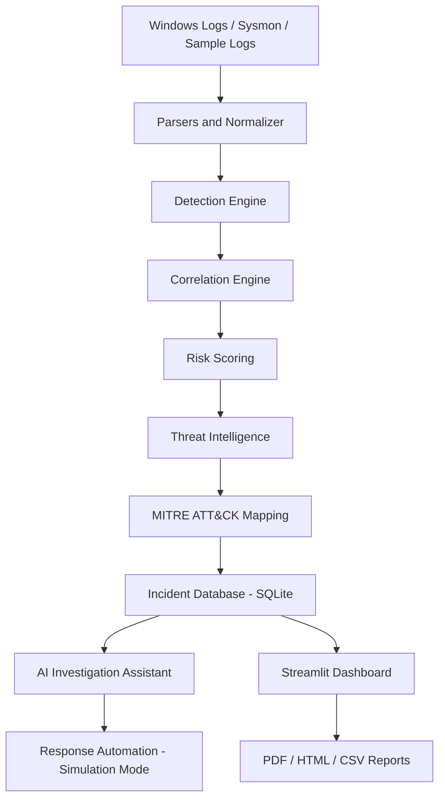
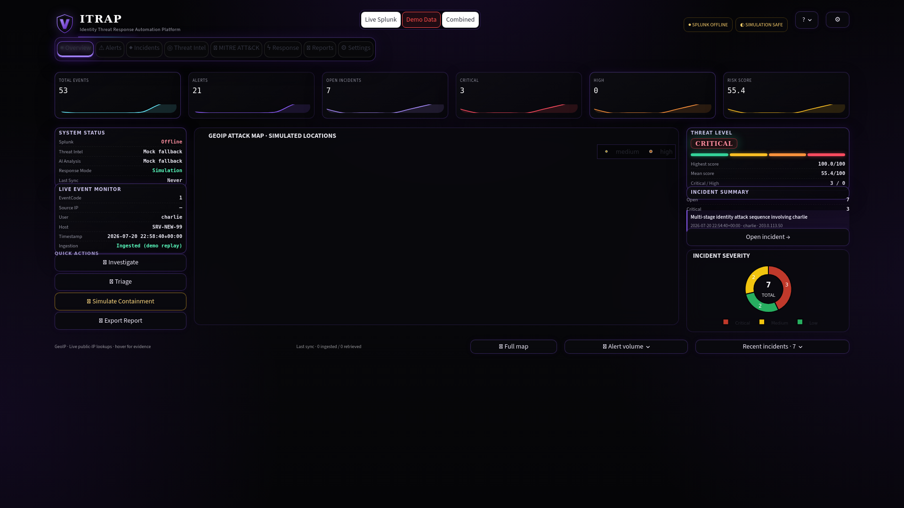
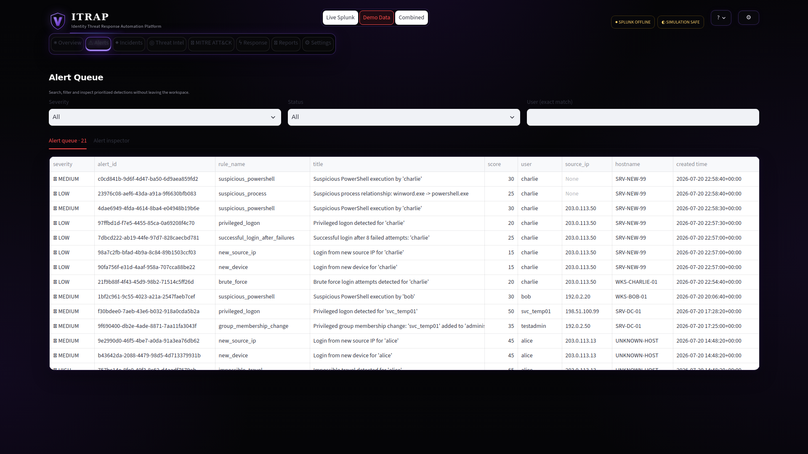
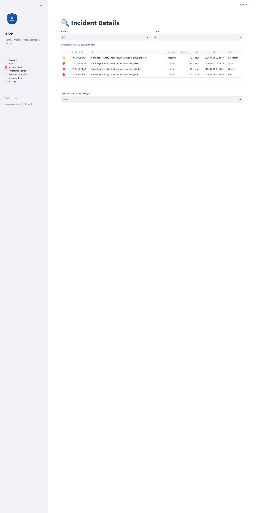
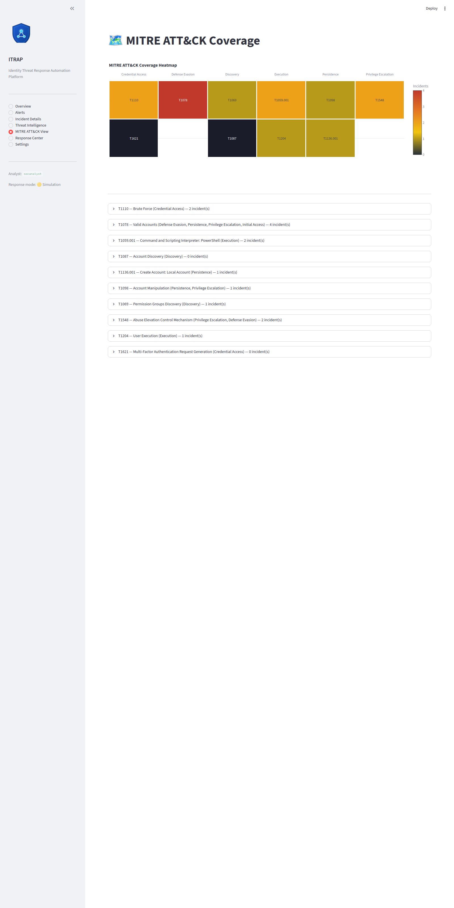
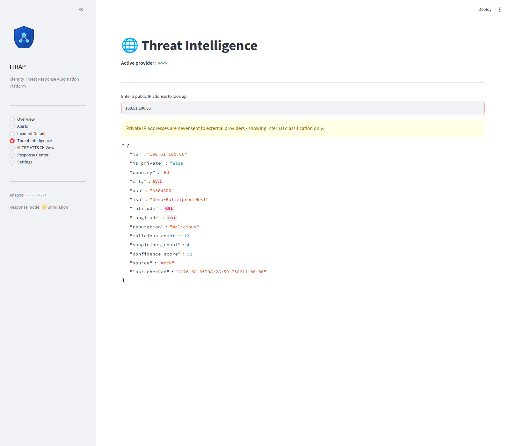
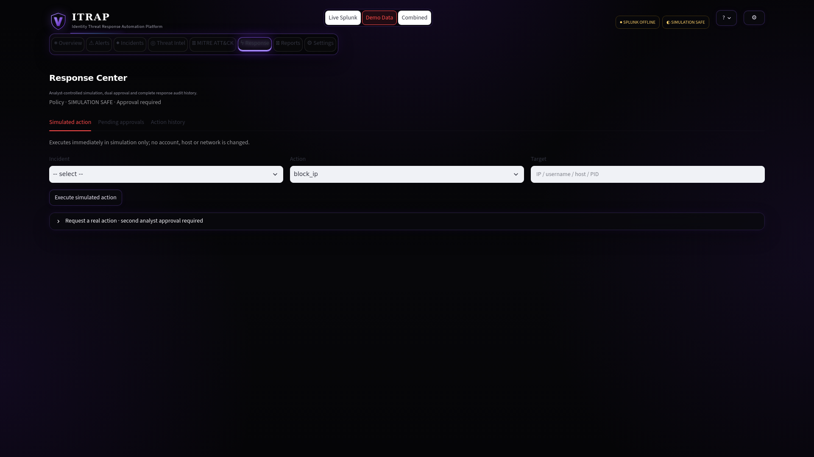
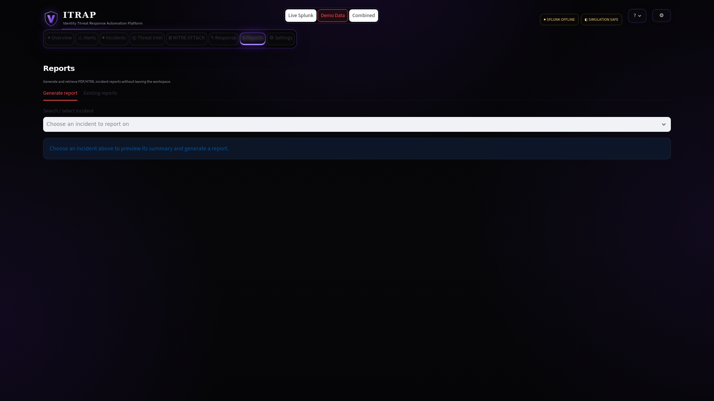
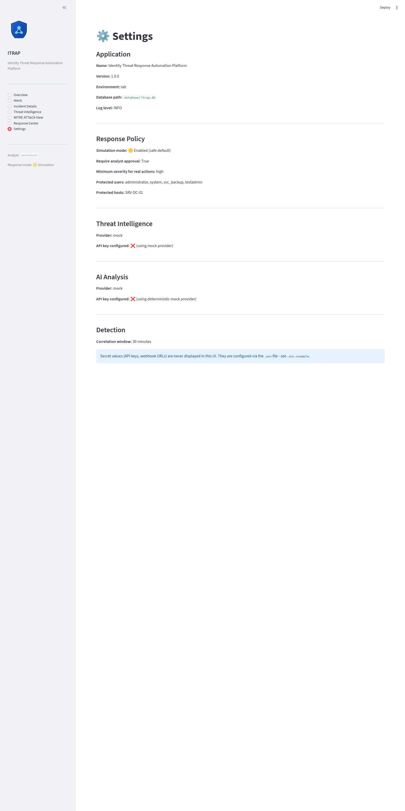

<p align="center">
  
</p>

# 🛡️ Identity Threat Response Automation Platform
## 🚀 Live Demo

[Open ITRAP SOC Command Center](https://itrap-soc-center.streamlit.app/)

> Demo Data mode is available publicly. Live Splunk integration is demonstrated through the local Windows lab because the Splunk Management API runs on localhost.
### A defensive SOC automation lab for identity threat detection, correlation, explainable risk scoring, MITRE ATT&CK mapping, and simulated incident response.

[](https://github.com/vasanth-void-0x/Identity-Threat-Response-Automation-Platform/actions)
[](https://www.python.org/)
[](LICENSE)
[](docs/response_automation.md)
[](docs/installation.md)

---

## Project Overview

**Identity Threat Response Automation Platform (ITRAP)** is a local, fully
functional SOC (Security Operations Center) lab that ingests Windows-style
identity and authentication logs, normalizes them into a common schema,
detects suspicious account activity through 11 rule-based detectors,
correlates related alerts into incidents, computes an **explainable** 0-100
risk score, maps activity to **MITRE ATT&CK**, enriches source IPs with
threat intelligence, generates AI-assisted (or deterministic) incident
summaries, and exposes everything through a Streamlit dashboard with
**simulation-mode-by-default** automated response.

It runs entirely offline on a laptop - **no paid services, no cloud
accounts, and no API keys are required** to see the full pipeline in action.

## Problem Statement

Identity-based attacks (credential stuffing, brute force, privilege abuse,
MFA fatigue, lateral movement via compromised accounts) are the single
largest initial-access vector in modern breaches, yet most portfolio SOC
projects only demonstrate a single detection rule in isolation. ITRAP
demonstrates the **full analyst workflow**: raw logs in, correlated,
risk-scored, MITRE-mapped incidents out, with investigation guidance and
safe response options - the actual job of a Tier 1/2 SOC analyst.

## Project Objectives

- Demonstrate end-to-end identity threat detection engineering, not just
  isolated detection scripts
- Show explainable, configurable risk scoring instead of opaque ML scores
- Correlate multi-stage attack sequences into single actionable incidents
- Map every detection to MITRE ATT&CK for analyst context
- Build a genuinely safe automation layer (simulation-first, policy-gated)
- Package it as a realistic, runnable, testable open-source portfolio project

## Key Capabilities

- 🖥️ One-screen, near-black glass SOC workspace with fixed bottom navigation
- 🔀 Explicit **Demo Data / Live Splunk / Combined** evidence modes
- 🗺️ Large focal GeoIP map with compact severity and alert-volume analytics
- 🔍 SOC alert monitoring and triage dashboard
- 🕵️ Identity threat detection across 11 rule types
- 🪟 Windows Security Event Log + Sysmon + PowerShell log analysis
- 🌐 IOC/IP enrichment (threat intelligence, GeoIP)
- 🗺️ MITRE ATT&CK technique and tactic mapping (with Navigator-style coverage heatmap)
- 🌍 GeoIP world map of attack source IPs
- 📊 Explainable, YAML-configurable risk scoring
- 🔗 Multi-alert incident correlation
- 🤖 AI-assisted (optional) or deterministic incident summaries
- ⚙️ Policy-gated automated response (simulation mode by default)
- 📄 PDF / HTML / CSV incident and executive reporting
- ✅ Full pytest coverage, no network calls required to test

## Dashboard Experience (v1.5.0)

The Overview is a one-screen SOC command centre: no page scrolling at
1366×768 or 1920×1080. Module navigation moved from the v1.3.5 right-side
dock to a **top navigation bar** (Overview · Alerts · Incidents · Threat
Intel · MITRE ATT&CK · Response · **Reports** · Settings). There is no page
heading on Overview by design - the KPI strip and HUD panels carry the
context instead, buying back the vertical space needed to keep everything
on one screen.

Page order top to bottom: header → navigation → a **six-card KPI strip**
(Total Events, Alerts, Open Incidents, Critical, High, Risk Score - each
card is value + an embedded sparkline in a single unified card, not two
stacked ones) → the main three-column dashboard → a slim footer.

Left column: **System Status** (Splunk / Threat Intel / AI provider /
response mode / last sync), **Live Event Monitor**, and a compact
**vertical Quick Actions** panel (Investigate → Triage → Simulate
Containment → Export Report - each deep-links into the right page with
context pre-filled; Simulate Containment keeps its amber warning styling).
Centre column: the large rectangular GeoIP attack map, now sized to fill
the space freed by moving Quick Actions off of it. Right column: **Threat
Level** (dynamic LOW→CRITICAL from the filtered incidents' highest risk
score, with a segmented risk bar), **Incident Summary** with a one-click
"Open incident" button, and the **Incident Severity donut**. The footer
keeps Full Map, alert-volume, and recent-incidents detail one click away
without spending permanent screen space on them.

Data-source mode and response mode are separate controls: choosing Live
Splunk does not enable real containment, and switching mode is never
silent - every panel (map, KPI strip, System Status, Live Event Monitor,
Threat Level, Incident Summary, severity donut) recomputes from the newly
selected mode on the same rerun, with no caching to go stale. Simulation
remains the safe default, and Demo Data is always the startup mode.
**Splunk connectivity status is evidence-based**: a configured token is
never shown as "online" by itself - the header only shows SPLUNK ONLINE
after an explicit Settings → Test Connection or a successful sync;
otherwise Live Splunk stays selectable and simply renders an honest empty
state.

Reports are now a first-class page: search/select an incident, preview its
summary, generate PDF/HTML, and browse every previously generated report
with its severity, timestamp, and download/preview controls - reusing the
existing `reports/report_builder.py` pipeline end-to-end. A matching
**Export Report** shortcut also sits next to the incident detail hero and
in Quick Actions.

The visual system is unchanged in spirit from v1.3.5: near-black
transparent glass panels, restrained dark-purple edge lighting, small cyan
accents, semantic severity colours, and the custom V shield mark - now
paired with a segmented risk bar, HUD card styling, and a navSignal pulse on
the active top-nav tab. All animation respects `prefers-reduced-motion`.


## Architecture


Full diagram set: `assets/diagrams/` (architecture, detection flow, incident
workflow, response flow - all render natively on GitHub).

## Detection Workflow

Raw log → `parsers/*` → `NormalizedEvent` (Pydantic) → 11 detection rules in
`detection_engine/rules/` evaluate the batch → each match becomes an `Alert`
with rule name, MITRE technique(s), and metadata → `risk_scoring.py`
attaches an explainable score → `correlation.py` groups related alerts
(same user/IP/host/device within a time window) into an `Incident` →
persisted to SQLite → visible on the dashboard.

## Incident Response Workflow

`New → Triaged → Investigating → Contained → Resolved` (or `False Positive`
at any point). See `docs/incident_workflow.md` and
`assets/diagrams/incident_workflow.mmd` for the full state diagram and
analyst actions available at each stage.

## Technology Stack

Python 3.11+, Streamlit, SQLite, Pandas, Plotly, PyYAML, python-dotenv,
Requests, Pydantic, ReportLab, Jinja2, pytest, PowerShell (Windows setup
scripts). Optional: VirusTotal API, AbuseIPDB API, GeoIP, Groq API (AI
summaries), Splunk/Wazuh/Sysmon adapters.

## Complete Feature List

See `docs/` for full detail on each area:
- 11 detection rules (`docs/detection_rules.md`)
- Explainable risk scoring (`docs/risk_scoring.md`)
- Incident correlation and lifecycle (`docs/incident_workflow.md`)
- MITRE ATT&CK mapping (built into the `mitre/` module + MITRE ATT&CK View page)
- Threat intelligence with mock/VirusTotal/AbuseIPDB providers
- AI-assisted analysis with mock/Groq providers
- Policy-gated response automation (`docs/response_automation.md`)
- PDF/HTML/CSV reporting
- Splunk/Wazuh/Sysmon integration adapters (`docs/*_integration.md`, `docs/sysmon_setup.md`)

## Supported Detection Rules

| Rule | MITRE | Event source |
|---|---|---|
| Brute Force | T1110 | 4625 |
| Successful Login After Failures | T1078, T1110 | 4624 + 4625 |
| New Source IP | T1078 | 4624 |
| New Device | T1078 | 4624 |
| Impossible Travel (Haversine) | T1078 | 4624 + GeoIP |
| Privileged Logon | T1078, T1548 | 4672 |
| Suspicious PowerShell | T1059.001 | 4104 |
| Account Lockout | T1110 | 4740 |
| Account Creation | T1136.001 | 4720 |
| Privileged Group Membership Change | T1098, T1069 | 4728, 4732 |
| Suspicious Process Creation | T1204, T1059.001 | 4688, Sysmon 1 |

Full detail: `docs/detection_rules.md`

## Supported Windows Event IDs

4624, 4625, 4634, 4648, 4672, 4688, 4720, 4722, 4725, 4726, 4728, 4732, 4740,
4768, 4769, 4771, 4776, 4104, plus Sysmon 1, 3, 11, 22. See
`core/constants.py` for the full mapping.

## Risk-Scoring Model

0-29 Low · 30-59 Medium · 60-79 High · 80-100 Critical. Every alert shows a
full breakdown of contributing factors; incident scores use a dampened sum
of each distinct rule's contribution so genuine multi-stage attacks surface
as CRITICAL rather than being capped at a single alert's score. Full detail
and worked example: `docs/risk_scoring.md`.

## MITRE ATT&CK Mapping

10 techniques mapped with descriptions, detection sources, and investigation
steps in `mitre/techniques.json`, surfaced on every alert/incident and on
the dedicated **MITRE ATT&CK View** dashboard page.

## Threat Intelligence

Mock provider (default, fully offline, deterministic) + optional VirusTotal
/ AbuseIPDB (real API, requires a free key in `.env`) + GeoIP (mock or live
via `threat_intelligence.geoip_provider`). Private and RFC 5737 reserved/
demo IPs are never sent to external providers - only genuine public IPs
reach a live provider, and results are cached. The dashboard clearly badges
whether attack-map locations are "🟡 Demo GeoIP — Simulated Locations" or
"🟢 Live GeoIP Data" - simulated coordinates are never presented as real.

## AI-Assisted Analysis

Mock provider (default, deterministic, offline) generates structured
incident summaries, findings, and recommendations from real incident data.
Optional Groq LLM provider available with `GROQ_API_KEY`. AI output is
**always an analyst aid** - it never automatically triggers a response
action.

## Automated Response Safety Controls

**Simulation mode is the default and cannot be silently overridden.** The
dashboard's primary button only ever simulates. Real execution requires a
full **two-person approval workflow**: an explicit environment flag, an
allowlisted action, a severity threshold, a non-protected target, **and**
sign-off from an analyst other than the requester - self-approval is
blocked in code. Every request/approval/rejection/execution is tracked
through explicit states (`pending_approval → approved/rejected → executed/
failed`) with full requester/approver/timestamp/result visibility in the
Response Center. Full detail: `docs/response_automation.md`.

## Live Integrations

Beyond the offline demo pipeline, ITRAP includes a real (not placeholder)
**Experimental Wazuh REST connector** (`integrations/wazuh_api_client.py`) with JWT
auth, pagination, timeouts, SSL verification, and duplicate-ingestion
prevention - triggered only by an explicit "Sync Wazuh Events" click on the
Settings page, never a background poller. It's covered by a fully-mocked
test suite but has not been validated against a live Wazuh server - see
`docs/wazuh_integration.md` for endpoint assumptions and setup.

## Dashboard Pages

Overview · Alerts · Incident Details · Threat Intelligence · MITRE ATT&CK
View · Response Center · **Reports** · Settings — all in `app/dashboard.py` +
`app/views/`, reached from the top navigation bar.

## Folder Structure

```
identity-threat-response-platform/
├── app/                    # Streamlit dashboard (pages, components, utils)
├── core/                   # config, logging, constants, exceptions, validators
├── models/                 # Pydantic data models (Event, Alert, Incident, ...)
├── parsers/                # JSON/CSV/Windows XML/Sysmon/PowerShell -> normalized events
├── detection_engine/       # 11 rules, correlation, risk scoring, orchestrator
├── mitre/                  # ATT&CK technique/tactic data + mapper
├── threat_intelligence/    # mock/VirusTotal/AbuseIPDB/GeoIP + cache + manager
├── ai_engine/               # mock/Groq incident summary providers
├── automation/              # policy-gated response actions (simulation default)
├── database/                # SQLite schema, connection, repository, seed
├── reports/                  # PDF/HTML/CSV report generation
├── integrations/             # optional Splunk/Wazuh/Sysmon adapters
├── sample_data/               # 14 synthetic demo scenarios
├── configs/                    # YAML configuration (rules, weights, policy)
├── scripts/                     # PowerShell setup/start/test/cleanup scripts
├── tests/                        # pytest suite (20 test files incl. Streamlit AppTest, no network calls)
├── docs/                          # 15 detailed documentation files
├── assets/                         # Mermaid diagrams, screenshots, sample reports
├── run.py / seed_demo.py            # convenience entry points
└── requirements.txt / pyproject.toml
```

## Prerequisites

Python 3.11+. No paid services required. Windows 10/11 recommended for the
PowerShell scripts (any OS works via the manual installation path).

## Windows Installation

```powershell
git clone https://github.com/vasanth-void-0x/Identity-Threat-Response-Automation-Platform.git
cd Identity-Threat-Response-Automation-Platform
.\scripts\setup.ps1
.\scripts\seed_demo.ps1
.\scripts\start.ps1
```

## Manual Installation

```bash
python -m venv .venv
source .venv/bin/activate        # Windows: .venv\Scripts\Activate.ps1
pip install -r requirements.txt
cp .env.example .env
python seed_demo.py
streamlit run app/dashboard.py
```

## Environment Configuration

Copy `.env.example` to `.env`. Every value is optional - the platform runs
fully offline with mock providers if left blank. See
`docs/configuration.md`.

## Running the Demo

```bash
python seed_demo.py
streamlit run app/dashboard.py    # or: python run.py
```
Opens at `http://localhost:8501`.

## Seeding Sample Data

```bash
python seed_demo.py            # clears existing demo data first
python seed_demo.py --no-clear # appends instead
```

## Running Tests

```bash
pytest -v
```
159 tests: unit/integration coverage for parsers, detection, correlation,
risk scoring, threat intel, reports, and the two live-integration clients,
plus `streamlit.testing.v1.AppTest` coverage for the Overview command
centre - every nav page, all three data modes, Quick Actions deep-links, the
Full Map view, and the Live Splunk empty/offline state (`tests/
test_overview_apptest.py`). The automated suite uses mocked network calls
and a fresh temporary SQLite database per test; no live credentials are
required.

## Generating Reports

Open the **Reports** page from the top navigation, search/select an
incident, and click **Generate PDF report** or **Generate HTML report** -
or use the **Export Report** Quick Action / the shortcut next to an
incident's hero metrics to jump there with the incident pre-selected.
Every previously generated report is listed on the same page with its
severity, created timestamp, and download/preview controls. CSV exports
are available via `reports.report_builder.export_alerts_csv()` /
`export_incidents_csv()`.

## Demo Scenarios

14 synthetic scenarios covering normal activity, brute force, impossible
travel, privileged logons, suspicious PowerShell, account creation/lockout,
privileged group changes, a full correlated multi-stage attack, and a
false-positive case. Full table: `docs/demo_scenarios.md`.

## Screenshots

Fresh screenshots captured from the v1.5.0 interface at 1920×1080 after
seeding the synthetic demo dataset.

| Overview command centre | Alerts (filterable triage) |
|---|---|
|  |  |

| Incident queue | MITRE ATT&CK coverage heatmap |
|---|---|
|  |  |

| Threat intelligence lookup | Response centre (simulation mode) |
|---|---|
|  |  |

| Reports workspace | Settings and integration status |
|---|---|
|  |  |

> The Overview page's world map needs internet access to `cdn.plot.ly` for
> base map boundary data (fetched client-side by Plotly.js) - it renders
> fully on any normally-connected machine. Every other feature in ITRAP,
> including all detection, scoring, and response logic, runs 100% offline.

## Demo Video

🎥 _For a full 2-3 minute narrated walkthrough (recommended for portfolio/interview
sharing), follow `docs/demo_video_script.md` - it is a ready-to-record
scene-by-scene script covering the full detection → correlation → investigation →
response flow._

## Live Demo

🔗 [Open the ITRAP SOC Command Center](https://itrap-soc-center.streamlit.app/)

The public deployment runs in Demo Data mode. Live Splunk connectivity is a
local-lab feature because the Splunk Management API is bound to localhost.

## Splunk / Wazuh / Sysmon Integration

The core platform runs without any of these. Splunk supports both file-export
ingestion and an analyst-triggered token-authenticated REST connector. Wazuh has **two** paths: a
file-export adapter (offline) and a real REST API client (JWT auth,
pagination, dedup - see "Live Integrations" above). Example SPL searches /
Wazuh alert mapping / API setup / Sysmon config guidance are documented in
`docs/splunk_integration.md`, `docs/wazuh_integration.md`, and
`docs/sysmon_setup.md`.

## Known Limitations

- Host isolation (`automation/isolate_host.py`) is intentionally **not**
  implemented for real execution - it requires an EDR/network-control
  integration out of scope for a local lab.
- No real ticketing system integration (Jira/ServiceNow) - `create_ticket`
  always simulates.
- The Wazuh REST API client has been built and tested against mocked
  responses matching Wazuh's documented API contracts, but **has not been
  validated against a live Wazuh server** - verify the alert-retrieval
  endpoint against your specific Wazuh version/deployment (Manager API vs.
  Indexer/OpenSearch API) before relying on it. See
  `docs/wazuh_integration.md`.
- Correlation is time/attribute based, not a full graph-based attack-chain
  reconstruction.
- Business-hours detection is a simple weekday/hour heuristic, not
  timezone-aware per user.
- SQLite is appropriate for a lab/demo scale, not production log volumes.
- The v1.5.0 Overview relayout (heading removed, KPI strip moved to top,
  Quick Actions moved into the left column, taller map, tightened spacing
  throughout) has been validated with `pytest`, `streamlit.testing.v1.AppTest`
  (full navigation, all three data modes with real widget clicks, all four
  Quick Actions, Full Map, and the Live Splunk empty/offline state), **and**
  a real headless-browser render at both 1366×768 and 1920×1080 (Playwright
  + Chromium), re-measuring actual DOM `scrollHeight` vs `clientHeight` after
  every layout change rather than assuming CSS estimates were correct. That
  process caught and fixed a real bug (independent of this relayout): a
  stale `5.05rem` bottom padding rule on `.block-container` that had no
  reason to be that large and was eating significant viewport space on every
  page, not just Overview. It also caught a genuine visual overlap (the
  "QUICK ACTIONS" label touching the button below it) introduced while
  compacting the new left-column panel, fixed and re-verified. At 1366×768
  the Overview now measures 769px of content against a 768px viewport (1px,
  visually imperceptible); 1920×1080 is an exact fit.
- The v1.4.0 pass before this one also found and fixed low text contrast on
  buttons/icon buttons (Streamlit 1.61 changed its internal button markup
  since this project was first built, so the color/background overrides were
  losing the specificity fight) and a leftover radio-circle indicator on the
  nav tabs. If you're on an older/newer Streamlit than the `>=1.38.0` floor
  in `requirements.txt`, sanity-check button contrast once after upgrading -
  Streamlit's internal DOM structure is not a stable contract and could
  shift again.
- The GeoIP map renders blank in network-restricted environments (including
  the sandbox this was built in) because `cdn.plot.ly` is unreachable there;
  it renders fully on any normally-connected machine, per the note above.
- Bottom-metric sparklines bucket by each metric's own observed
  min→max timestamp range, not a rolling wall-clock window, so they stay
  meaningful for both historical demo scenarios and live data regardless of
  when the underlying events occurred.

## Troubleshooting

See `docs/troubleshooting.md` for common issues (missing Python, empty
dashboard, module errors, threat intel provider fallback behavior).

## Security Considerations

No offensive capability, no hardcoded secrets, secret redaction in logs,
private IPs never sent externally, parameterized SQL only, synthetic data
only (safe names + RFC 5737 demo IP ranges). Full detail:
`docs/security.md`.

## Ethical Use Statement

This project is a **defensive security lab and portfolio artifact**. It
contains no exploit code, malware, credential-harvesting logic, or
authentication-bypass techniques. All sample data is synthetic. Automated
response defaults to simulation mode and requires deliberate, multi-step
opt-in for any real system change, which should only ever be done in an
isolated lab environment you own and control.

## Future Roadmap

Additional production hardening, pluggable YAML-defined rules, chat-based
interactive triage, historical trend dashboards, real EDR integration, and
formal detection-accuracy measurement. Full list: `docs/roadmap.md`.

---

## Learning Outcomes

Detection engineering with explainable scoring, log normalization across
heterogeneous sources, MITRE ATT&CK-driven investigation design, safe
automation/policy design for irreversible actions, and building a
demoable full-stack SOC tool with a real test suite.

## Contributing

Issues and PRs welcome. Please run `pytest -v` before submitting, avoid
committing secrets, and keep any new response action defaulting to
simulation mode. See `.github/pull_request_template.md`.

## License

MIT - see [LICENSE](LICENSE).

## Author

**Vasanth Kumar**
SOC Analyst | Cybersecurity Analyst

- GitHub: [vasanth-void-0x](https://github.com/vasanth-void-0x)
- LinkedIn: [vasanth-2k4](https://linkedin.com/in/vasanth-2k4)
- Portfolio: _add portfolio link here_
